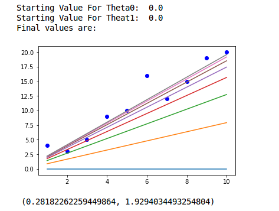

This types of model can be seen in the terms of geometry of instance space. What we mean here is that Regression mean a fixed output in an unbounded range of possibilities. Unlke classfication where we have to decide between a set of things and pick one, here we have to give a thing. It's actually pretty easier then classifiers. Mathematically speaking regressiona is aa algorithm which you would result you a fixed number, and classifier results you a fixed class.

Now, talking about linear regression. What actually happens under the hood is that we try to fit a linear line, in such a way that we would be able to prdict the value of most training examples correctly. And as soon as very are closer to such a boundary, we stop and start prediciting on unseen data. By unseen data, we mean such data which is not seen before by the model.

Linear models are parametric, meaning the have small number of numeric parameters that need to be learned from data. Another interesting fact about them is, that the are prone to overfitting but sometimes lead to underfitting.

# Linear Regression
The goal of linear regression is to find a relationship between y -> x. Such that y = f(x).

###Least Square Method 
Consider a set of points marked on x - axis and y - axis.

Let,there be a point (xi,yi). The goal is to find a line y = (a*x) + b. Where the (Ypredicted - Yactuall) ~ 0.

For this what we do is that we take an error E, where 
E = | Y_predicted - Y_actuall |, or  
E = (Y_predicted - Y_actuall)2.

The motive is to take the magnitude of error without considering the sign.

Then just , to get mean squared error. Now based on this error we update our parameters.

Thats what we do in everyday life pretty much.
* See how bad your output is.
* Try to make it less bad.
* Repeat

## Math
The question remains, how should we update the parameters. We know that it has something to do with the error we got but what exactly is it.

The Equation/Hypothesis: .

The Error/Cost function: .

Now, here is the trick the parameters will updated as :-	
	.

On solving we will get, 
	.

# What it might look like

_How it would find a best fit_

# Hello Python

Use back-ticks for `inline code`. Multi-line code snippets are supported too through Pygments.


// importing libraries
import numpy as np
import matplotlib.pyplot as plt
import pandas as pd

//Some random data
x = np.array([1,2,3,4,5,6,7,8,9,10])
y = np.array([4,3,5,9,10,16,12,15,19,20])

//Initiallizing theta
theta0 = 0.0
theta1 = 0.0

//Utility functions
def h(theta0,theta1,x,i):
    return theta0 + (theta1*x[i])

def cost(theta0,theta1,x,y):
    j = 0
    for i in range(y.shape[0]):
        j += (h(theta0,theta1,x,i) - y[i])**2
    return j

def updateParam(theta0,theta1,x,y,alpha):
    t0 = 0
    t1 = 0
    for i in range(x.shape[0]):
        t0 += (y[i] - h(theta0,theta1,x,i))
        t1 += (y[i] - h(theta0,theta1,x,i))*x[i]
    t0 *= alpha
    t1 *= alpha
    theta0 += t0
    theta1 += t1
    return theta0,theta1

def startDescent(theta0,theta1,x,y):
    alpha = 0.001
    prevC = 0
    plt.plot(x,y,'bo')
    while True:
        xAxis = []
        yAxis = []
        for i in range(x.shape[0]):
            xAxis.append(x[i])
            yAxis.append(h(theta0,theta1,x,i))
        plt.plot(xAxis,yAxis)
        c = cost(theta0,theta1,x,y)
        if c-prevC < 30:
            plt.show()
            return theta0,theta1
        else:
            theta0,theta1 = updateParam(theta0,theta1,x,y,alpha)

print "Starting Value For Theta0: ",theta0
print "Starting Value For Theat1: ",theta1
print "Final values are: ",startDescent(theta0,theta1,x,y)



### GoodBye
> Work untill your could, would, should become did.

